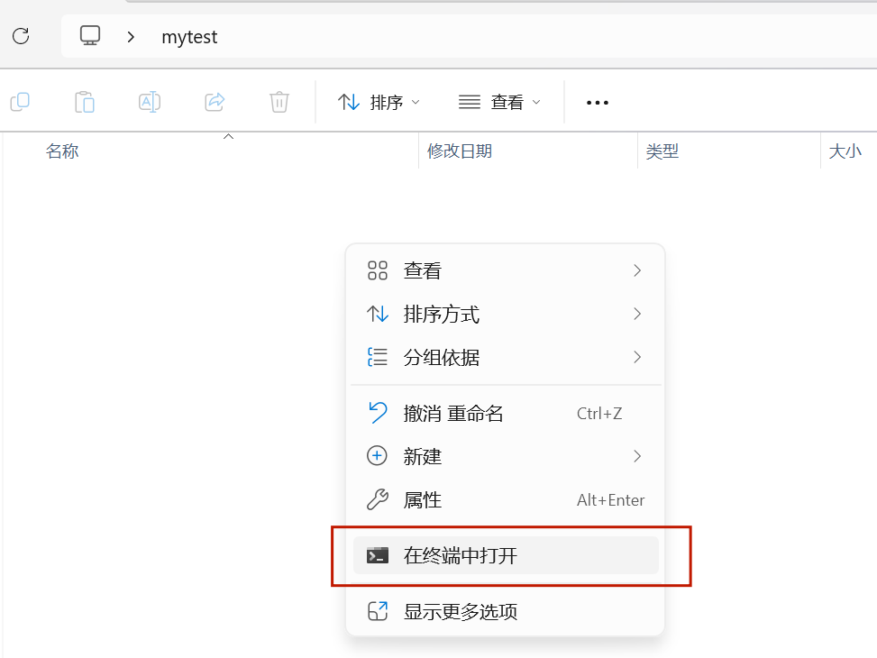
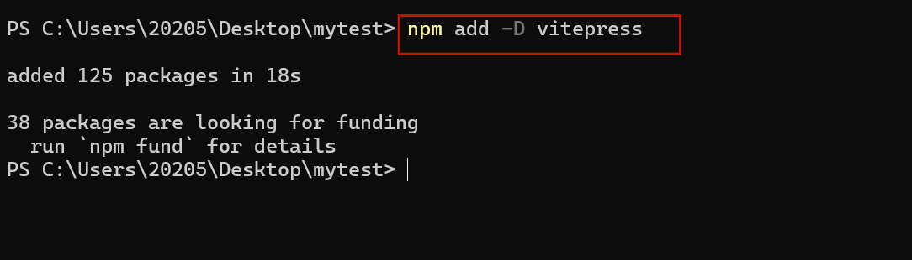
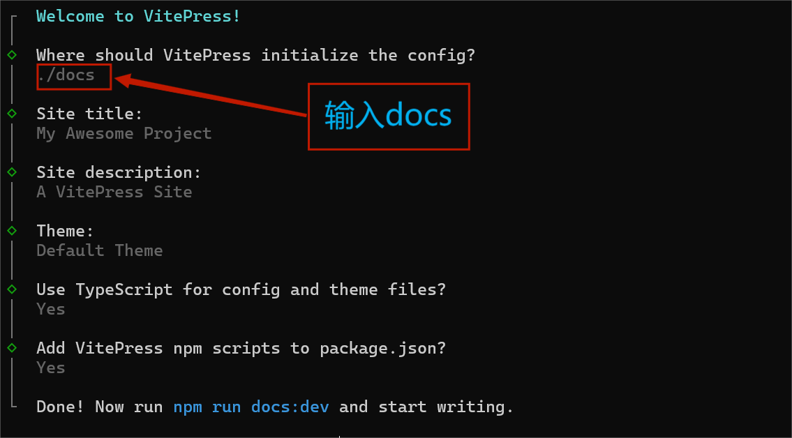
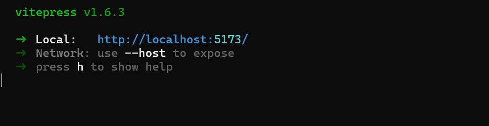
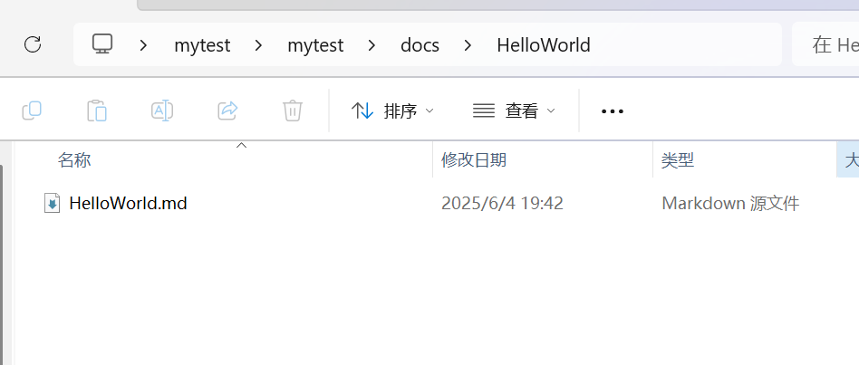
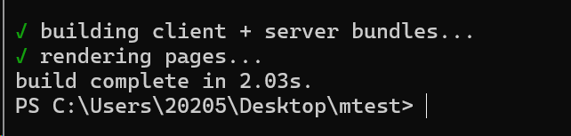

# 二、 手把手教你搭建属于自己的技术博客（基于VitePress）

## 1. 环境准备
安装node.js

node.js下载地址：<https://nodejs.cn/download/>。
安装完成后，在终端输入指令：`node -v`，查看node.js版本。
## 2.创建项目
### 2.1 创建项目目录
在桌面新建一个文件夹（mytest）用于存放项目，打开该文件夹，在文件夹内点击右键打开终端



### 2.2 安装VitePress
将VitePress安装到当前项目目录下，输入指令：`npm add -D vitepress`。

### 2.3 初始化项目
在终端输入指令：`npx vitepress init`，根据下图填写信息，回车即可。

### 2.4 启动项目
在终端输入指令：`npm run docs:dev`，启动项目。在浏览器中输入：`localhost:5173`，如果显示正常，则说明项目创建成功。

## 3. Markdown基础语法
  加粗：`**加粗**` 

  斜体：`*斜体*` 

  换行：两个回车

  标题：`# 一级标题` `## 二级标题` `### 三级标题`

  引用：`> 引用` 

  列表：
  ```
  - 无序列表
  + 无序列表
  * 无序列表
  ```

  ```
  1. 有序列表
  2. 有序列表
  3. 有序列表
  ```
 
  链接：`[链接名称](链接地址)` 

  图片：`` 

## 4. 编写文件
### 4.1 编写首页
编写docs目录下的index.md文件，可以参考我的配置。
```
---
# https://vitepress.dev/reference/default-theme-home-page
layout: home

hero:
  name: "孟柯的技术笔记"
  #text: "A VitePress Site"
  tagline: 欢迎来到我的博客！在这里，我将分享Java后端开发与大模型应用领域的前沿知识与实践经验。欢迎一起探索技术前沿，解锁更多可能～ 
  actions:
  - text: 开始学习 →
    link: /HelloWorld/HelloWorld
    type: primary

features:
  - #icon: https://picsum.photos/seed/github/64/64
    title: 🐱 GitHub
    details: '查看我的开源项目和代码(https://github.com/mengkecoding)'  # 单引号包裹 Markdown 链接
    link: https://github.com/mengkecoding
  - #icon: https://picsum.photos/seed/csdn/64/64
    title: 📝 CSDN
    details: '阅读我的博客文章(https://blog.csdn.net/kijio)'  # 单引号包裹 Markdown 链接
    link: https://blog.csdn.net/kijio
  - #icon: https://picsum.photos/seed/wechat/64/64
    title: 📱 公众号
    details: 关注我的公众号：小孟的技术笔记，获取最新技术文章
  - #icon: https://picsum.photos/seed/xiaohongshu/64/64
    title: 🌸 小红书
    details: 小红书ID：6913281270
  - #icon: https://picsum.photos/seed/weixin/64/64
    title: 💬 抖音
    details: 抖音ID：meng_0927
  - #icon: https://picsum.photos/seed/weixin/64/64
    title: 💬 微信
    details: 微信：mengkecoding，欢迎添加我为好友一起交流
---
```


### 4.2 编写其他页面
在docs目录下新建一个文件夹（HelloWorld），在HelloWorld文件夹下新建一个HelloWorld.md文件，在HelloWorld.md文件中编写以下内容：



```
# 一、 手把手教你部署HelloWorld到云服务器
## 1. 购买一台云服务器
首先需要购买一台装有linux系统的云服务器，阿里云、火山引擎、腾讯云、华为云、京东云首次购买轻量的云服务都在40-60元/年（2核2G），我购买的是华为的云服务器，需要设置服务器的账号密码，安装系统镜像大概需要2-5分钟的时间，记住自己的公网ip地址。
## 2. 应用上传服务器前的准备
### 2.1 更新软件包列表信息
在终端输入指令：`sudo apt update`
### 2.2 安装JDK17
在终端输入指令：`sudo apt install openjdk-17-jdk`
### 2.3 创建部署目录
在终端输入指令：`mkdir ~/spring-apps`
## 3.创建一个HelloWorld项目
### 3.1 点击New Project
### 3.2 点击Spring Boot，按图示进行配置
### 3.3 勾选Spring Web，创建项目
### 3.4 创建HelloController类
```
### 4.3 更新配置文件
更新.vuepress目录下的config.mts文件，进行如下配置：
```
import { defineConfig } from 'vitepress'
// 为了解决找不到模块的问题，可添加类型声明来处理 SVG 导入

// https://vitepress.dev/reference/site-config
export default defineConfig({
  title: "孟柯的技术笔记",
  description: "A VitePress Site",
  themeConfig: {
    // https://vitepress.dev/reference/default-theme-config
    nav: [
      { text: '主页', link: '/' },
      { text: '笔记', link: '/HelloWorld/HelloWorld' }
    ],

    sidebar: [
      {
        text: '教程',
        items: [
          { text: '部署HelloWorld到云服务器', link: 'HelloWorld/HelloWorld' }
        ]
      }
    ],

    socialLinks: [
      { icon: 'github', link: 'https://github.com/mengkecoding' }
    ]
  }
})

```
更新配置文件后，参考**第二章**的内容运行项目，测试效果。   

## 5. 生成静态页面
在**项目目录**下打开终端，输入指令：`npm run docs:build`，生成静态页面。


## 6. 将静态页面部署到自己的云服务器
### 6.1 上传静态页面到服务器
在云服务器中使用mkdir指令创建/var/www/mytest目录，用于存放静态页面。
```
mkdir /var/www/mytest
```

使用scp命令将静态页面上传到服务器，在终端输入指令(需要根据自己的情况修改指令，详见我的第一篇文章)：
```
scp -r C:\Users\20205\Desktop\mytest\docs\.vuepress\dist\* root@1.92.211.91:/var/www/mytest/
```
### 6.2 安装Nginx
在服务器终端输入命令：`sudo apt install nginx`
### 6.3 配置Nginx
在服务器终端输入命令：`sudo vim /etc/nginx/sites-available/your-domain`，打开Nginx配置文件。
在文件中添加以下内容：
```
server {
    listen 80;
    server_name mengkecoding.cn www.mengkecoding.cn;
    
    # 更新为新路径
    root /var/www/mytest;
    index index.html;

    location / {
        try_files $uri $uri/ /index.html;
    }
    }
```

### 6.4 确保Nginx有权限访问项目所在目录
在终端输入以下指令：
```
sudo chown -R www-data:www-data /var/www/mytest
sudo chmod -R 755 /var/www/mytest
```
### 6.5 验证配置并重启Nginx
在终端输入以下指令：
```
sudo nginx -t
sudo systemctl restart nginx
```
### 6.6 通过域名访问静态页面
参考第一篇文章配置域名解析后，在浏览器中输入域名即可访问静态页面。

